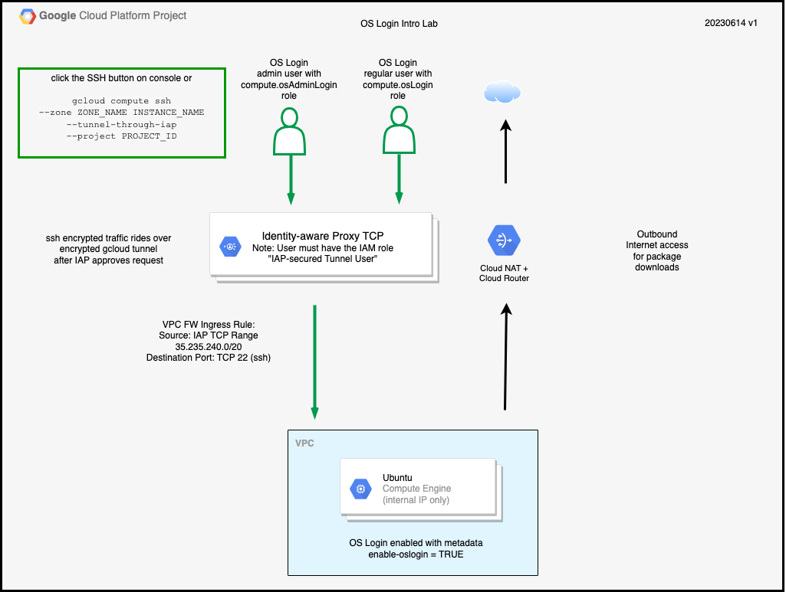

# Identity Labs for Google Cloud - OS Login Collection - OS Login Intro Lab

## Introduction

[OS Login](https://cloud.google.com/compute/docs/oslogin) is a feature of Compute Engine that propogates your Google Identity to a Linux user account.
With OS Login, you can use IAM to control access to Linux VMs.

To configure OS Login you must enable OS Login by either organizational policies or metadata and then grant access to the instance.

* To manage the enforcement of OS Login through [organization policy](https://cloud.google.com/compute/docs/oslogin/set-up-oslogin#enable_os_login), you can enforce or not enforce the `compute.requireOsLogin` at the organization, folder, and projcet levels.

* To enable OS Login using [metadata](https://cloud.google.com/compute/docs/oslogin/set-up-oslogin#enable_os_login), you can set the `enable-oslogin` metadata key to TRUE at the project or instance level.

* You also need to add the appropriate IAM roles at either the project or instance level.

    * roles/compute.osAdminLogin - enables administrative access, the ability to `sudo` without supplying a password

    * roles/compute.osLogin - enables regular access

In this lab, you will build an environment that enables OS Login.
You will test logging in with both an administrative user and a regular user.

## Assumptions/Prerequsites

1. You have some familiarity with the items below.

    * Using the Google Cloud Console and Cloud Shell
    * Core Google Cloud terminology such as project IDs
    * Google Cloud services such as IAM and Compute Engine
    * Using Terraform

1. The username used for building this demo must have the following project-level IAM role in  both projects.

    * Owner - This role is needed because the Terraform code creates IAM bindings on service accounts.

1. You must have the following organization role.

    * Organization Policy Administrator

1. You need a new Google Cloud project id.

1. You need two new Cloud Identity user ids in the same Google Cloud organization as your project, one which will be used to test administrative OS Login access, and one for testing regular OS Login access.
    They should be new IDs because the Terraform code will add project-based IAM permissions for them.

## Tested configuration

This installation was performed with the configuration listed below.

* Google Cloud SDK 432.0.0
* Terraform v1.4.6
+ provider registry.terraform.io/hashicorp/google v4.67.0
+ provider registry.terraform.io/hashicorp/local v2.4.0
+ provider registry.terraform.io/hashicorp/random v3.5.1
+ provider registry.terraform.io/hashicorp/time v0.9.1

## Architecture Overview

Here is a diagram of what you will build.


<p align="Center">Figure 1 - OS Login Intro Lab architecture</p>

Figure 1 shows an
instance running the Ubuntu operating system.
The instance has no external IP address.
There are two users that will receive permissions to log into the Compute Engine instance.
The OS Login admin user will be given administrative access by being granted the compute.osAdminLogin role.
The Os Login regular user will be given regular access by being granted to compute.osLogin role.
The left side of Figure 1 shows the ingress TCP flow.

Users wanting to SSH into the instance click the SSH button on the Compute Engine console or uses "gcloud compute ssh --tunel-through-IAP" to begin the session.
The Identity-aware Proxy then prompts the user for their identity.
If the identity has the "IAP-secured Tunnel User" role, an encrypted tunnel is created between the console or the gcloud client to the Google tunnel endpoint.
After the tunnel is created to the private IP address of the instance, SSH then begins an encrypted session through the encrypted tunnel to the instance thus providing two layers of encryption.
The OS Login flow on the instance will then determine which kind of access (administrative or regular) the user should have.

The right portion of Figure 1 shows the egress flow.
The instance uses [Cloud NAT](https://cloud.google.com/nat/docs/overview) for outbound internet access in order to download packages and updates. 

## Build instructions

### Initial setup

1. Sign in to the [Google Cloud console](https://console.cloud.google.com) as the owner of the project and launch the [Cloud Shell](https://cloud.google.com/shell/docs/launching-cloud-shell#launch_from_the).


### Download the lab repository

1.  Clone this repository to your Cloud Shell.

    ```
    git clone https://github.com/jeffscottlevine/identity-labs-google-cloud.git
    ```

2. Change your working directory to this lab in the newly cloned repository.

    ```
    cd identity-labs-google-cloud/oslogin/oslogin-intro
    ```

3. Set the environment variable to the current directory for easy navigation.

    ```
    export DEMOHOME=`pwd`
    ```

### Deploy the lab

1. Change to the Terraform directory.

    ```
    cd $DEMOHOME/terraform
    ```

1. Create the terraform.tfvars file from the terraform.tfvars.example file.

    ```
    cp terraform.tfvars.example terraform.tfvars
    ```

1. Using the text editor of your choice, open the terraform.tfvars file. Look for the line that appears below. 

    ```
    project_id  = "GOOGLE_CLOUD_PROJECT_ID"
    oslogin_admin_username = "ADMIN_USERNAME"
    oslogin_regular_username = "REGULAR_USERNAME"
    ```

1. Replace the following values:
    * *GOOGLE_CLOUD_PROJECT_ID* with your Google Cloud project id
    * *ADMIN_USERNAME* with the fully qualified username you will use to test administrative OS Login access (e.g. user1@example.com)
    * *REGULAR_USERNAME* with the fully qualified username you will use to test regular OS Login access (e.g. user2@example.com)

1. Save the terraform.tfvars file and exit the text editor.

1. In order to test the enablement of the OS Login by setting metadata, you must ensure that the
    ```compute.requireOsLogin``` boolean constraint is not enforced for the project.

    Use the command below to disable the enforcement of the constraint, substituting your project ID for PROJECT_ID.

    ```
    gcloud resource-manager org-policies disable-enforce \
    compute.requireOsLogin \
    --project=PROJECT_ID
    ```

1. Enable the IAM and Compute Engine APIs in the project.
    Use the command below substituting your project ID for PROJECT_ID.

    ```
    gcloud services enable \
    iam.googleapis.com \
    compute.googleapis.com \
    --project PROJECT_ID
    ```

1. Use the commands below to build this Terraform module.

    ```
    terraform init
    terraform plan --out=plan.out
    terraform apply plan.out
    ```

    You should see the message "Apply Complete" followed by output values.

1. The outputs will look similar to the figure below.

    ```
    Message-01 = "PLEASE WAIT 3-5 MINUTES FOR THE COMPUTE INSTANCE TO COMPLETELY INITIALIZE!"
    display_metadata_command = "gcloud compute instances describe oslogin-912ccd4c --zone us-central1-a --format='value[](metadata.items)' --project YOUR_PROJECT_ID"
    random_suffix_for_cloud_resource_names = "912ccd4c"
    ssh_command = "gcloud compute ssh --zone us-central1-a demo-912ccd4c --tunnel-through-iap --project YOUR_PROJECT_ID"
    ```

    The output fields have the following meanings.

    * Message-01 - a message asking that you wait 3-5 minutes after Terraform completes for the instance to initialize
    * display_metadata_command - the command to display the instances metadata key/value pairs
    * random_suffix_for_cloud_resource_names - eight hexadecimal digits used to make the resource names in the project unique
    * ssh_command - the command to log into the server that was created by Terraform

    You will use these output values later in the lab. You can display the outputs again by running the command below.

    ```
    terraform output
    ```

1.  As noted previously, please wait 3-5 minutes after Terraform has completed before proceeding with the lab.

### Checking the metadata

1.  Get the `display_metadata_command` output value.

    ```
    terraform output | grep display_metadata_command
    ```

1.  Copy the command between the quotation marks (") and paste it into the Cloud Shell and run it.

    You will see output similar to the example below.

    ```
    {'key': 'enable-oslogin', 'value': 'TRUE'}
    ```

    This shows that the enable-oslogin metadata key has been set to TRUE, which enables OS Login.

1.  List the project-level IAM grants for your project using the following commmand substituting your project ID for *PROJECET_ID*.

    ```
    gcloud projects get-iam-policy PROJECT_ID
    ```

    In the output you will see the following role grants,
    subsituting the values you entered into the file terraform.tfvars for *ADMIN_USERNAME* and *REGULAR_USERNAME*.

    ```
    - members:
      - user:ADMIN_USERNAME
      role: roles/compute.osAdminLogin
    - members:
      - user:REGULAR_USERNAME
      role: roles/compute.osLogin
    ```

### Test logging in from the Administrative OS Login username

1.  Get the `ssh_command` output value.

    ```
    terraform output | grep ssh_command
    ```

    Copy the value between the quotation marks (") to your clipboard or a scratch file.

1. In a *separate browser profile* (not a browser *tab* in the profile where you built the demo), sign in as the username you are using for administrative OS Login access and start a Google Cloud console seesson and the Cloud Shell.

1. In the Cloud Shell, paste in the value you copied for the ssh command and run it.

    You may need to agree to the Google Terms of Service and acknoweldge other prompts.
    You will be logged in as the administrative OS Login user.

1. Look at the command prompt.
    The username portion of the command prompt appears before the "@" character.
    The special characters in the username ("@" and ".") have been replaced by underscores.
    The maximum length of the username is 32 characters, which is the limit specified in the [useradd(8)](https://manpages.ubuntu.com/manpages/bionic/en/man8/useradd.8.html) man page. 

1. Start a root shell using this command.

    ```
    sudo sh
    ```

    You should see a root prompt ("#").
    This shows that the administrative username was allowed by OS Login to log in as a user who could gain administrative access.

1.  Exit administrative mode and exit the Cloud Shell with these commands.

    ```
    exit
    exit
    ```

1.  Sign out of your profile.

### Test logging in from the regular (non-administrative) OS Login username

1.  Get the `ssh_command` output value.

    ```
    terraform output | grep ssh_command
    ```

    Copy the value between the quotation marks (") to your clipboard or a scratch file.

1. In a *separate browser profile* (not a browser *tab* in the profile where you built the demo), sign in as the username you are using for regular (non-administrative) OS Login access and start a Google Cloud console seesson and the Cloud Shell.

1. In the Cloud Shell, paste in the value you copied for the ssh command and run it.

    You may need to agree to the Google Terms of Service and acknoweldge other prompts.
    You will be logged in as the administrative OS Login user.

1. Look at the command prompt.
    The username portion of the command prompt appears before the "@" character.
    As before, the special characters in the username ("@" and ".") have been replaced by underscores.

1. Try to start a root shell using this command.

    ```
    sudo sh
    ```

    You will not be granted root access.  You will instead be prompted for a password.
    This shows that the regular username was not allowed by OS Login to log in as a user who could gain administrative access and was instead granted regular (non-administrative) access.

1.  Exit the Cloud Shell with this command.

    ```
    exit
    ```

1.  Sign out of your profile.


You have completed the lab.
You have studied the following topics.

* enabling OS Login by setting the `enable-oslogin` instance metadata key to a value of `TRUE`

* granting administrative access by granting the project-level role of roles/compute.osAdminLogin to a username

* granting regular access by granting the project-level role of roles/compute.osLogin to a username 

### Clean up

Please follow the steps below to remove the lab environment.

1. Change your working directory to the Terraform code directory for the demo.

    ```
    cd $DEMOHOME/terraform
    ```

2. Use the command below to destroy the demo environment.

    ```
    terraform destroy
    ```

    Respond with *yes* when asked to confirm that you want to destroy the resources.

3. Upon successful completion, you will see "Destroy complete."

1. If desired, remove the customized contraint setting you created for `compute.requireOsLogin`.
