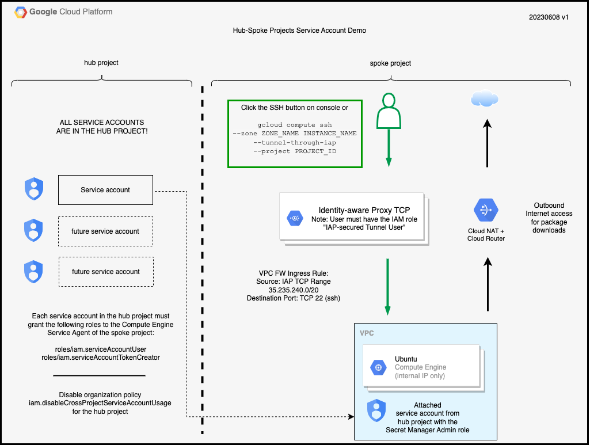
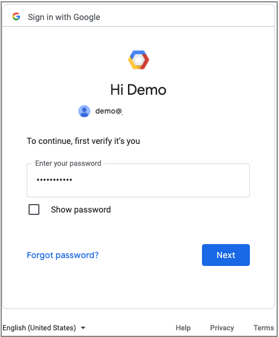
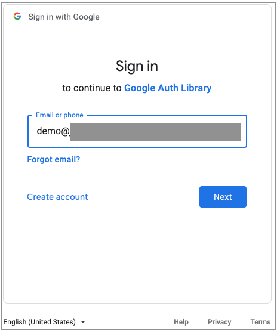

# Identity Labs for Google Cloud - Service Account Collection - Hub and Spoke Project Demo

## Introduction

A service account is non-user principal that is used by an application or workload.
An application can use the credentials provided by the service account to call Google Cloud APIs.
Service accounts are often attached to Google Cloud resources such as Compute Engine instances.

You will likely create many service accounts as you work with Google Cloud projects.
There are two common approaches to managing multiple service accounts.

* The first option is put service accounts in the same project as the resources that use them.
    This approach is easier to implement but it becomes much harder as to keep track of the service accounts as you deal with a larger number of projects and service accounts.

* The second option is to put all of the service accounts into a common project.
    This approach makes it much easier to keep track of service accounts but it does take more configuration effort.

In this demo, you will learn about sharing service accounts across projects.
You will build an environment with Terraform that contains two projects.
The *hub* project will contain a service account.
The *spoke* projecet will contain a Compute Engine instance to which the service account in the hub project will be attached.
The service account will have the Secret Manager Admin role in the spoke project.
You will connect to this instance and create a secret to validate the permissions.

## Assumptions/Prerequsites

1. You have some familiarity with the items below.

    * Using the Google Cloud Console and Cloud Shell
    * Core Google Cloud terminology such as project IDs
    * Google Cloud services such as IAM and Compute Engine
    * Using Terraform

1. You have two new Google Cloud projects that will run in a non-production setting preferably in a Google Cloud organization.

1. The username used for building this demo must have the following project-level IAM role in  both projects.

    * Owner - This role is needed because the Terraform code creates IAM bindings on service accounts.

1. You or someone you know has the following organization role.

    * Organization Policy Administrator

1. You have access to a workstation on which the [Google Cloud SDK](https://cloud.google.com/sdk/docs/install) and [Terraform] have been installed.
    The instructions are written using an independent workstation but you can adapt the instructions for use on the Cloud Shell.

## Tested configuration

This installation was performed with the configuration listed below.

* Google Cloud SDK 432.0.0
* Terraform v1.4.6
+ provider registry.terraform.io/hashicorp/google v4.67.0
+ provider registry.terraform.io/hashicorp/local v2.4.0
+ provider registry.terraform.io/hashicorp/random v3.5.1
+ provider registry.terraform.io/hashicorp/time v0.9.1

## Architecture Overview

Here is a diagram of what you will build.


<p align="Center">Figure 1 - Hub and Spoke Projcts for Service Account demo architecture</p>

Figure 1 shows two projects, the *hub* project on the left and the *spoke* project on the right.
The *hub* project has central resources that will be shared with the *spoke* project.
The service account in the hub project is an identity that will be shared.
It is important to understand that only the service account's identity is shared, not any attached project-level roles.
To attach the service account in the *hub* project to the Compute Engine instance in the *spoke* project, the service account resource-based 
permissions must grant the Compute Engine Service Agent of the *spoke* project both the Service Account User (`roles/iam.serviceAccountUser`) and the Service Account Token Creator (`roles/iam.serviceAccountTokenCreator`) roles.
Lastly, the project constraint `iam.disableCrossProjectServiceAccountUsage` must not be enforced to permit the sharing of service accounts across projects.
Consult the Google Cloud documentation to learn more about [cross-project service account usage](https://cloud.google.com/iam/docs/attach-service-accounts#attaching-different-project).

The *spoke* project on the right shows an instance running the Ubuntu operating system.
The instance has no external IP address.
All inbound ssh access will be provided by the [Identity-Aware Proxy](https://cloud.google.com/iap).
The service account from the *hub* project will be attached to the *spoke* instance.

A user wanting to SSH into the instance clicks the SSH button on the Compute Engine console or uses `gcloud compute ssh --tunel-through-IAP` to begin the session.
The Identity-aware Proxy then prompts the user for their identity.
If the identity has the IAP-secured Tunnel User role (`roles/iap.tunnelResourceAccessor`), an encrypted tunnel is created between the console or the gcloud client to the Google tunnel endpoint.
After the tunnel is created to the private IP address of the instance, SSH then begins an encrypted session through the encrypted tunnel to the instance thus providing two layers of encryption.
For egress, the instance uses [Cloud NAT](https://cloud.google.com/nat/docs/overview) for outbound internet access in order to download packages and updates. 

## Build instructions

### Configure authentication

1. Start a terminal session on your workstation.

1. Sign on to your Google Cloud account as the user for the Google Cloud project using the command below.

    ```
    gcloud auth login
    ```

    In addition to the user ID and password, you may also be asked to grant access to the Google Cloud SDK.  See Figure 2 for more details.


    | Enter user | Enter password | Grant access |
    | :-: | :-: | :-: |
    |  |  |  |

    <p align="Center">Figure 2 - Google SDK sign in process</p>

1. Set your application default credentials so Terraform has credentials to run.

    ```
    gcloud auth application-default login 
    ```
    You may be prompted for a user ID and password and also to grant access to the Google Auth Library as shown in Figure 3.
    | Enter user | Grant access |
    | :-: | :-: |
    |  |  |

    <p align="Center">Figure 3 - Google application login</p>

1.  You may be asked if you want to enable the Cloud Resource Manager API (`cloudresourcemanager.googleapis.com`).  Enter "y" to confirm.

1. Enable the IAM, IAM Credentials, Compute Engine, and Resource Manager APIs in **both** of the new projects.

    ```
    gcloud services enable iam.googleapis.com
    gcloud services enable iamcredentials.googleapis.com
    gcloud services enable compute.googleapis.com
    gcloud services enable cloudresourcemanager.googleapis.com
    ```

### Download the lab repository

1. If you haven't already done so, clone this repository to your workstation.

    ```
    git clone https://github.com/jeffscottlevine/identity-labs-google-cloud.git
   ```

2. Change your working directory to this lab in the newly cloned repository.

    ```
    cd identity-labs-google-cloud/service-accounts/hub-spoke-projects
    ```

3. Set the environment variable to the current directory for easy navigation.

    ```
    export DEMOHOME=`pwd`
    ```

### Deploy the lab

1. Choose which project id will be the hub project and which will be the spoke project.
    In the remainder of this document, these will be referred to as *HUB_PROJECT* and *SPOKE_PROJECT*.

1. Change to the Terraform directory.

    ```
    cd $DEMOHOME/terraform
    ```

1. Create the terraform.tfvars file from the terraform.tfvars.example file.

    ```
    cp terraform.tfvars.example terraform.tfvars
    ```

1. Using the text editor of your choice, open the terraform.tfvars file.
    Look for the line that appears below. 

    ```
    hub_project_id  = "YOUR_HUB_PROJECT_ID"
    spoke_project_id = "YOUR_SPOKE_PROJECT_ID"
    ```

1. Replace the values YOUR_HUB_PROJECT_ID and YOUR_SPOKE_PROJECT_ID with the values *HUB_PROJECT* and *SPOKE_PROJECT*.
    Be sure retain the quotation marks.

1. Save the terraform.tfvars file and exit the text editor.

1. In order to attach a service account from the hub project to the spoke project, you need to ensure that the
    ```iam.disableCrossProjectServiceAccountUsage``` boolean constraint is not enforced for the hub project.

    Use the command below to disable the enforcement of the constraint, substituting HUB_PROJECT for PROJECT_ID

    ```
    gcloud resource-manager org-policies disable-enforce \
    iam.disableCrossProjectServiceAccountUsage \
    --project=HUB_PROJECT
    ```

1. Set your default project ID to the hub project ID using the command below, remembering to substitude the hub project ID for HUB_PROJECT.

   ```
   gcloud config set project HUB_PROJECT
   ```

1. You are now ready to deploy the demo environment.
    Use the commands below to build this Terraform module.

    ```
    terraform init
    terraform plan --out=plan.out
    terraform apply plan.out
    ```

    When Terraform is running, you will see the following message.

    ```
    time_sleep.wait_3_minutes: Creating...
    ```

    A three minute delay begins after the IAM bindings are created in the hub project to propagate.

    > IAM bindings are [eventually consistent](https://cloud.google.com/iam/docs/access-change-propagation).
    The IAM bindings in the hub project must complete before the instance in the spoke project can attach the service account in the hub project.
    Three minutes appears to be enough time.
    If it is not long enough, you will receive an error message from Terraform about the Service Account User or Service Account Token Creator roles.
    If that happens, repeat the `terraform plan` and `terraform apply` commands above to resume the script.

    You should see the message "Apply Complete" followed by output values.

1. The outputs section will look similar to the figure below.

    ```
    Message-00 = "Please wait a few minutes for the compute instance to initialize."
    hub_service_account = "secret-admin-sa-563880fa@hub-20230606.iam.gserviceaccount.com"
    random_suffix_for_cloud_resource_names = "563880fa"
    ssh_command = "gcloud compute ssh --zone us-central1-a server-spoke-project-563880fa --tunnel-through-iap --project spoke-20230606"
    ```

    The output fields have the following meanings.

    * Message-01 - a message asking that you wait 3-5 minutes after Terraform completes for the instance to run a startup script
    * hub_service_account - the service account attached to the instance
    * random_suffix_for_cloud_resource_names - eight hexadecimal digits used to make the resource names in the project unique
    * ssh_command - the command to log into the instance that was created by Terraform

    You will use these output values later in the lab. You can display the outputs again by running the command below.

    ```
    terraform output
    ```

1. As noted previously, please wait 3-5 minutes after Terraform has completed before proceeding with the lab.

1. The *spoke* project has a project-level IAM binding that grants the service account in the *hub* project access to the *spoke* project.
    You will now look at this binding.

    Substitute your spoke project ID for SPOKE_PROJECT.

    ```
    gcloud projects get-iam-policy SPOKE_PROJECT
    ```

    There are two bindings that you will see in portions of the output, one for each service account.
    The random suffix at the end of each service account name will be that shown by Terraform.

    ```
    - members:
      - serviceAccount:secret-admin-sa-563880fa@hub-20230606.iam.gserviceaccount.com
      role: roles/secretmanager.admin
    ```

    This confirms that the service account has the Secret Manager Admin role.

1. Service accounts can also have *resource* permissions that describe what actions can be done with the service accounts as a resource.
    You will now look at the *resource* permissions assigned to the secret-admin-sa service account.

    Retrieve the name of the hub_service_account service account using the command below.

    ```
    terraform output|grep hub_service_account
    ```

    Retrieve the resource permissions on the service account using the command below, substituting your service account for the one below and the hub_project for HUB_PROJECT.
   
    ```
    gcloud iam service-accounts get-iam-policy secret-admin-sa-912ccd4c@YOUR_PROJECT_ID.iam.gserviceaccount.com --project HUB_PROJECT
    ```

    You should see something similar to the output below.

    ```
    - members:
      - serviceAccount:service-SPOKE_PROJECT_NUMBER@compute-system.iam.gserviceaccount.com
      role: roles/iam.serviceAccountTokenCreator
    - members:
      - serviceAccount:service-SPOKE_PROJECT_NUMBER@compute-system.iam.gserviceaccount.com
      role: roles/iam.serviceAccountUser
    ```

    The service account `service-SPOKE_PROJECT_NUMBER@compute-system.iam.gserviceaccount.com` refers to the Compute Engine Service Agent.
    The Compute Engine Service Agent provides services to a Compute Engine instance.
    One of the purposes of the Compute Engine Service Agent is to present the service account to the instance.
    The resource-level binding on the *hub* service account grants access to the Compute Engine Service Agent in the *spoke* project to allow
    the instance in the *spoke* project to attach the service account.
    
1. To test the attachment of the service account with the Secret Manager Admin role, you will log into the instance and create a secret.


    Use the command below to retrieve the Terraform outputs.

    ```
    terraform output
    ```

    Copy the value of the ssh_command output without the quotation marks (") and run it.  The command will look similar that shown below.

    ```
    gcloud compute ssh --zone us-central1-a demo-912ccd4c --tunnel-through-iap --project SPOKE_PROJECT
    ```

    You will then be logged into the instance.

1. The instance provides you with an environment variable SECRET_NAME which contains a random secret name.
    Display the variable using the command below.

    ```
    echo $SECRET_NAME
    ```

    You should see values such as those shown below.

    ```
    secret-912ccd4c
    ```

1. Try to create a secret with the Secret Manager service using the command below.

    ```
    gcloud secrets create $SECRET_NAME
    ```

    The command will succeed because the attached service account has the Secret Manager Admin role.

1.  Delete the secret using the command below.

    ```
    gcloud secrets delete $SECRET_NAME
    ```

1.  Log out of the instance using the command below.

    ```
    exit
    ```

You have completed the lab in which a service account in hub project is attached to an instance in a spoke project.
This methodology can be used to create a hub project which contains the all the service accounts in an organization
and then using the service accounts in multiple spoke projects.

You have learned the following skills as part of this lab.

* enabling the sharing of service accounts by disabling the enforcement of the `iam.disableCrossProjectServiceAccountUsage` constraint in a hub project
* adding the Service Account User and Service Account Token Creator to the hub service account
* testing the attached service account

### Clean up

Please follow the steps below to remove the lab environment.

1. Change your working directory to the Terraform code directory for the demo.

    ```
    cd $DEMOHOME/terraform
    ```

2. Use the command below to destroy the demo environment.

    ```
    terraform destroy
    ```

    Respond with *yes* when asked to confirm that you want to destroy the resources.

3. Upon successful completion, you will see "Destroy complete."

1. If desired, remove the customized contraint setting you created for `iam.disableCrossProjectServiceAccountUsage`.
