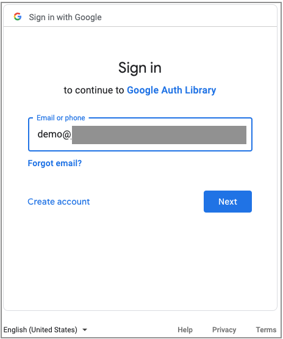

# Identity Labs for Google Cloud - Service Account Collection - Single Project Impersonation Lab

## Introduction

A service account is non-user principal that is used by an application or workload.
An application can use the credentials provided by the service account to call Google Cloud APIs.
Service accounts are often attached to Google Cloud resources such as Compute Engine instances.

Service account impersonation is when a user or service account authenticates as another service account.
Impersonation is often used to obtain temporary elevated credentials for performing tasks.
Impersonation would be similar to using *sudo* in Linux or *RunAs* in Windows environments.

In this lab, you will learn about service account metadata and service account impersonation.
In particular you will:

* build an environment with Terraform that contains a Compute Engine instance with a low privilege service account
* use the Google Cloud SDK to run a command with the privileges of the service account
* fetch instance metadata to call a Google Cloud API directly
* attempt some high-privileged tasks and fail because of the low privileges on the instance.
* impersonate a higher privilege service account and perform the same tasks with the impersonated credentials
and succeed

## Assumptions/Prerequsites

1. You have some familiarity with the items below.

    * Using the Google Cloud SDK (the `gcloud` command)
    * Core Google Cloud terminology such as project IDs
    * Google Cloud services such as IAM and Compute Engine
    * Using Terraform

1. You have a new Google Cloud project that will run in a non-production setting preferably in a Google Cloud organization.

1. The username used for building this lab must have the following project-level IAM role.

    * Owner - This role is needed because the Terraform code creates IAM bindings on service accounts.

1. You have access to a workstation on which the [Google Cloud SDK](https://cloud.google.com/sdk/docs/install) and [Terraform] have been installed.
    The instructions are written using an independent workstation but you can adapt the instructions for use on the Cloud Shell.

## Tested configuration

This installation was performed with the configuration listed below.

* Google Cloud SDK 432.0.0
* Terraform v1.4.6
* provider registry.terraform.io/hashicorp/google v4.67.0
* provider registry.terraform.io/hashicorp/local v2.4.0
* provider registry.terraform.io/hashicorp/random v3.5.1

## Architecture Overview

Here is a diagram of what you will build.


<p align="Center">Figure 1 - Service account single project lab architecture</p>

Figure 1 shows an
instance running the Ubuntu operating system.
The instance has no external IP address.
All inbound ssh access will be provided by the Identity-Aware Proxy.
The service account on the instance has the Compute Viewer role.

The left section of Figure 1 shows the ingress TCP flow.
A user wanting to SSH into the instance clicks the SSH button on the Compute Engine console or uses "gcloud compute ssh --tunel-through-IAP" to begin the session.
The Identity-aware Proxy then prompts the user for their identity.
If the identity has the "IAP-secured Tunnel User" role, an encrypted tunnel is created between the console or the gcloud client to the Google tunnel endpoint.
After the tunnel is created to the private IP address of the instance, SSH then begins an encrypted session through the encrypted tunnel to the instance thus providing two layers of encryption.

The right portion of Figure 1 shows the egress flow.
The instance uses [Cloud NAT](https://cloud.google.com/nat/docs/overview) for outbound internet access in order to download packages and updates. 

There is also a standalone service account with the Secret Manager Admin role.
The service account attached to the instance will impersonate this standalone service account.

## Build instructions

### Configure authentication

1. Start a terminal session on your workstation.

1. Sign on to your Google Cloud account as the user for the Google Cloud project using the command below.

    ```
    gcloud auth login
    ```

    In addition to the user ID and password, you may also be asked to grant access to the Google Cloud SDK.  See Figure 2 for more details.


    | Enter user | Enter password | Grant access |
    | :-: | :-: | :-: |
    |  |  |  |

    <p align="Center">Figure 2 - Google SDK sign in process</p>

1. Set your default project ID using the command below, using your project ID in place of *INSERT-PROJECT-ID-HERE*.

   ```
   gcloud config set project INSERT-PROJECT-ID-HERE
   ```

1. Set your application default credentials so Terraform has credentials to run.

    ```
    gcloud auth application-default login 
    ```
    You may be prompted for a user ID and password and also to grant access to the Google Auth Library as shown in Figure 3.
    | Enter user | Grant access |
    | :-: | :-: |
    |  |  |

    <p align="Center">Figure 3 - Google application login</p>

1. You may be asked if you want to enable the Cloud Resource Manager API (`cloudresourcemanager.googleapis.com`).  Enter "y" to confirm.

1. Enable the IAM, IAM Credentials, and Compute Engine APIs.

    ```
    gcloud services enable iam.googleapis.com
    gcloud services enable iamcredentials.googleapis.com
    gcloud services enable compute.googleapis.com
    ```

### Download the lab repository

1. If you haven't already done so, clone this repository to your workstation.

    ```
    git clone https://github.com/jeffscottlevine/identity-labs-google-cloud.git
    ```

2. Change your working directory to this lab in the newly cloned repository.

    ```
    cd identity-labs-google-cloud/service-accounts/single-project
    ```

3. Set the environment variable to the current directory for easy navigation.

    ```
    export DEMOHOME=`pwd`
    ```

### Deploy the lab

1. Change to the Terraform directory.

    ```
    cd $DEMOHOME/terraform
    ```

1. Create the terraform.tfvars file from the terraform.tfvars.example file.

    ```
    cp terraform.tfvars.example terraform.tfvars
    ```

1. Using the text editor of your choice, open the terraform.tfvars file. Look for the line that appears below. 

    ```
    project_id  = "GOOGLE_CLOUD_PROJECT_ID"
    ```

1. Replace *GOOGLE_CLOUD_PROJECT_ID* with your Google Cloud project id. Do not delete the quotation marks (").

1. Save the terraform.tfvars file and exit the text editor.

1. Use the commands below to build this Terraform module.

    ```
    terraform init
    terraform plan --out=plan.out
    terraform apply plan.out
    ```

    You should see the message "Apply Complete" followed by output values.

    If you receive an error message telling you that the IAM service has not been enabled, the enablement of the service
    within the Terraform code may not have completed yet.
    Repeat the three terraform commands to recover.

1. The outputs will look similar to the figure below.

    ```
    Message-01 = "PLEASE WAIT 3-5 MINUTES FOR THE COMPUTE INSTANCE TO COMPLETELY INITIALIZE!"
    compute_viewer_service_account = "compute-viewer-sa-912ccd4c@YOUR_PROJECT_ID.iam.gserviceaccount.com"
    instance_name = "demo-912ccd4c"
    random_suffix_for_cloud_resource_names = "912ccd4c"
    secret_admin_service_account = "secret-admin-sa-912ccd4c@YOUR_PROJECT_ID.iam.gserviceaccount.com"
    ssh_command = "gcloud compute ssh --zone us-central1-a demo-912ccd4c --tunnel-through-iap --project YOUR_PROJECT_ID"
    ```

    The output fields have the following meanings.

    * Message-01 - a message asking that you wait 3-5 minutes after Terraform completes for the instance to run a startup script
    * compute_viwer_service_account - the service account attached to the instance with the Compute Viewer role
    * instance_name - the name of the instance
    * random_suffix_for_cloud_resource_names - eight hexadecimal digits used to make the resource names in the project unique
    * secret_admin_service_account - a service account with Secret Manager Admin capabilities
    * ssh_command - the command to log into the server that was created by Terraform

    You will use these output values later in the lab. You can display the outputs again by running the command below.

    ```
    terraform output
    ```

1.  As noted previously, please wait 3-5 minutes after Terraform has completed before proceeding with the lab.

### Examining the service accounts

1.  Terraform created two service accounts in the project.  Use the command below to see the names of the service accounts.

    ```
    terraform output | grep service_account
    ```

    The service account with the email address beginning with `compute-viewer-sa` has the Compute Viewer role which provides the ability to see information about Compute Engine instances.
    The service account with the email address beginning with `secret-admin-sa` has the Secret Manager Admin role which provides the ability to manage secrets with the Secret Manager service.
    Notice that each service account name includes a random suffic to make them unique.
    The random suffix value is shown in the `random_suffix_for_cloud_resource_names` output value from Terraform.
  
1. The service accounts generated by Terraform have project-level IAM bindings which grant the service accounts permissions in the project.
    You will now look at those bindings.

    Substitute your project ID for *YOUR_PROJECT_ID*.

    ```
    gcloud projects get-iam-policy *YOUR_PROJECT_ID*
    ```

    There are two bindings that you will see in portions of the output, one for each service account.
    The random suffix at the end of each service account name will be that shown by Terraform.

    ```
    - members:
      - serviceAccount:compute-viewer-sa-912ccd4c@YOUR_PROJECT_ID.iam.gserviceaccount.com
      role: roles/compute.viewer
    ```

    ```
    - members:
      - serviceAccount:secret-admin-sa-912ccd4c@YOUR_PROJECT_ID.iam.gserviceaccount.com
      role: roles/secretmanager.admin
    ```

    This confirms that the service accounts have the expected IAM role bindings.

1. The permissions you just looked at were *project-level* IAM permissions.
    These are permissions that the service accounts have as *pricipals* within the project.
    They describe what the service accounts as *principals* can do within the project.

    Service accounts can also have *resource* permissions that describe what actions can be done with the service accounts as a resource.
    You will now look at the *resource* permissions assigned to the secret-admin-sa service account.

    Retrieve the name of the secret-admin-sa service account using the command below.

    ```
    terraform output|grep secret-admin-sa
    ```

    Retrieve the resource permissions on the service account using the command below, substituting your service account for the one below
   
    ```
    gcloud iam service-accounts get-iam-policy secret-admin-sa-912ccd4c@YOUR_PROJECT_ID.iam.gserviceaccount.com
    ```

    You should see something similar to the output below.

    ```
    bindings:
    - members:
      - serviceAccount:compute-viewer-sa-912ccd4c@YOUR_PROJECT_ID.iam.gserviceaccount.com
      role: roles/iam.serviceAccountTokenCreator
    ```

    This binding shows us that the compute-viewer-sa service account has the ability to create tokens from the secret-admin-sa service account.
    This ability is called *service account impersonation*.
    Service account impersonation allows one principal, the compute-viewer-sa service account attached to the instance,
    to temporarily use (or impersonate) the secret-admin-sa service account and gain the capabilities of the Secret Manager Admin role.
    You will experiment with impersonation in the second part of the lab.

1. Now you will log in to the instance created by Terraform. Use the command below to retrieve the Terraform outputs.

    ```
    terraform output
    ```

    Copy the value of the ssh_command output without the quotation marks (") and run it.  The command will look similar that shown below.

    ```
    gcloud compute ssh --zone us-central1-a demo-912ccd4c --tunnel-through-iap --project YOUR_PROJECT_ID
    ```

    You will then be logged into the instance.

1. The compute-viewer-sa service account is attached to the instance.
    The service account has the Compute Viewer role which should allow you to get information about Compute Engine instances.
    You will now test this using the command below.

    ```
    gcloud compute instances list
    ```

    You should see a list of all the instances in the project.
    This confirms that the Compute Viewer role is working as expected.

You have completed the first part of the lab which shows the operation of an attached service account using the Google Cloud SDK (gcloud command).
In the next part of the lab you will do the same thing with service account metadata.
Do not log out of the instance as you will need to remain logged in for the next part of the lab.

### Using Service Account Metadata

When a Google Cloud instance is running with an attached service account, that instance can query the metadata server to obtain credentials and call Google Cloud APIs directly.
In this portion of the lab, you will learn to use metadata.

1. Go to the `/usr/local/bin` directory and list its contents.

    ```
    cd /usr/local/bin
    ls
    ```

    Here is a description of the files.

    | Name | Description |
    | --- | --- |
    | compute-instances-list | call the compute.instances.list API |
    | create-secret | create a secret without impersonation |
    | delete-secret | delete a secret without impersonation |
    | gcpmd-access-token | display the access token from the metadata |
    | gcpmd-access-token-info | send the access token to the tokeninfo endpoint |
    | gcpmd-access-token-long | display the long form of the access token |
    | gcpmd-all | display all metadata |
    | gcpmd-project-id | display the current project ID from the metadata |
    | gcpmd-sa-email | display the service account email from the metadata |
    | gcpmd-zone | display the zone from the metadata |
    | impersonate-create-secret | create a secret using impersonation |
    | impersonate-delete-secret | delete a secret using impersonation |

    You will use some of the scripts in this part of the demo and some in the second part.
    Some of the scripts use metadata to extract information about the running environment.
    You will learn about the service account metadata because the metadata server provides the crendtials needed to leverage the capabilities of the service account.


    > Instance metadata contains a lot of sensitive information and is often used to perform reconnaissance.  For this reason it is a best practice to follow the principal of least privilege and only grant the service account the privileges it needs.

1.  Look at the script `gcpmd-all`.

    ```
    cat gcpmd-all
    ```

    The contents of the script appear below.

    ```
    METADATA_URL="http://metadata.google.internal/computeMetadata/v1"
    curl --silent "$METADATA_URL/?recursive=true" \
      -H "Metadata-Flavor: Google" | jq --monochrome-output
    ```

    The script defines a variable to point to a metadata URL.
    The `curl` command is used call the URL and the `jq` command does some postprocessing.
    Note the presence of the `Metadata-Flavor: Google` header which is supplied for additional security.
    Without that header, the metadata query will be ignored.

    Now run the script.

    ```
    gcpmd-all
    ```

    You will see all of the instance metadata except for the access token which you will fetch in the next step.
    The demo uses the `curl` command since these are shell scripts.
    Google Cloud also provides libraries for a variety of programming languages to do URL queries.

1.  Look at the script `gcpmd-access-token-long`.

    ```
    cat gcpmd-access-token-long
    ```

    The content appears below.

    ```
    METADATA_URL=\
    "http://metadata.google.internal/computeMetadata/v1"\
    "/instance/service-accounts/default/token"

    ACCESS_TOKEN_LONG=`curl --silent "$METADATA_URL" \
    -H "Metadata-Flavor: Google"`
    echo $ACCESS_TOKEN_LONG | jq --monochrome-output
    ```

    Now run the script.

    `gcpmd-access-token-long`

    The output appears below.

    ```
    {
      "access_token": "ya29.c. ... bYM-nvQfo5R7y5",
      "expires_in": 1735,
      "token_type": "Bearer"
    }
    ```

    The `access token` field of the output is an OAuth 2.0 token which can be used to call Google Cloud APIs.
    The `expires_in` is the number of seconds remaining in the token's lifetime.
    Access tokens by default have a one-hour lifetime after which you can request another.
    If you use Google Cloud's language libraries, they typically deal with token expiration and request new access tokens
    on your behalf unless you are doing impersonation which will be discussed in the second part of the lab.
    The `token_type` field is `Bearer` which means that any entity possessing the token can present ("bear") it to
    request services.
    For this reason, bearer tokens must be secured.

1.  If you only want the access token itself, you can use the `gcpmd-access-token` script to display it.
    Try it for yourself.

    ```
    gcpmd-access-token
    ```

    If you examine the script, you will see it's very similar to the `gcpmd-access-token-long`
    except it uses the `jq` command to extract the token field.
    This is the same output that you get from the following command.

    ```
    gcloud auth print-access-token
    ```

1.  If you have only an access token and want to get information about it, you can pass it to
    the `tokeninfo` endpoint.
    Take a look at the `gcpmd-access-token-info` script.

    `cat gcpmd-access-token-info`

    Now run the script to see what it returns

    ```
    gcpmd-access-token-info
    ```

1.  Now let's get back to the service account attached to the instance.
    You've already verified the service account has the `Compute Viewer` role.
    You will now call the `compute.instances.list` API.

    To find out the format of the URL for the API, you can consult the [API's reference page](https://cloud.google.com/compute/docs/reference/rest/v1/instances/list).
    The URL has the format below.

    ```
    https://compute.googleapis.com/compute/v1/projects/{project}/zones/{zone}/instances
    ```

1.  Look at the script `compute-instances-list`.

    ```
    cat compute-instances-list
    ```

    The script contains the following commands.

    ```
    ZONE=`gcpmd-zone`
    ACCESS_TOKEN=`gcpmd-access-token`
    PROJECT_ID=`gcpmd-project-id`

    curl --silent \
    https://compute.googleapis.com/compute/v1/projects/$PROJECT_ID/zones/$ZONE/instances \
    -H "Authorization":"Bearer $ACCESS_TOKEN" |\
    jq --monochrome-output '.items[] | { name, zone, machineType, status }'
    ```

    Note that the URL in the `curl` command is the same as the one on the reference page.
    The zone and project ID are included in the URL and the access token is included in the
    `Authorization` header.

    Now run the script.

    ```
    compute-instances-list
    ```

    You will see the output that would normally appear when you run the `gcloud compute instances list` command.

1. You can also go to the [API reference page](https://cloud.google.com/compute/docs/reference/rest/v1/instances/list) and use the *Try this method* window on the right side of the page.
    Expand the *Show standard parameters* section to expose the *access token* field.
    Enter the *project*, *zone*, and *access_token* fields and click *Execute* and you will see the output of the API as well.

You have completed the second part of the lab which shows how to use instance metadata to get credentials for the compute-viwewer-sa service account and call Google Cloud APIs.
In the next part of the lab you will explore service account impersonation.
Do not log out of the instance as you will need to remain logged in for the next part of the lab.

### Performing impersonation

You have now seen how the attachment of a service account to an instance provides credentials.
The compute-viewer-sa service account allowed you to list the Compute Engine instances.
You will now consider the matter of service account impersonation.

1. The instance provides you with an environment variable SECRET_NAME which contains a random secret name.
    Display the variable using the command below.

    ```
    echo $SECRET_NAME
    ```

    You should see values such as those shown below.

    ```
    secret-912ccd4c
    ```

1. Try to create a secret with the Secret Manager service using the command below.

    ```
    gcloud secrets create $SECRET_NAME
    ```

    The command will fail because the compute-viewer-sa service account does not have the permissions needed to create secrets.
    The secret-admin-sa service account has the appropriate permissions to create secrets.
    You also saw that the compute-viewer-sa service account has permission to impersonate the secret-admin-sa service account.
    You will now test service account impersonation

1. The instance provides you with an environment variable SECRET_ADMIN_SA which contains the name of the secret-admin-sa service account
    Display the variable using the command below.

    ```
    echo $SECRET_ADMIN_SA
    ```

    You should see values such as those shown below.

    ```
    secret-admin-sa-912ccd4c@YOUR_PROJECT_ID.iam.gserviceaccount.com
    ```

1.  Create the secret by using the command below.

    ```    
    gcloud secrets create $SECRET_NAME --impersonate-service-account $SECRET_ADMIN_SA
    ```

    You will receive some warning messages about using impersonation followed by confirmation that the secret has been created.

    ```
    WARNING: This command is using service account impersonation. All API calls will be executed as [secret-admin-sa-912ccd4c@YOUR_PROJECT_ID.iam.gserviceaccount.com].
    WARNING: This command is using service account impersonation. All API calls will be executed as [secret-admin-sa-912ccd4c@YOUR_PROJECT_ID.iam.gserviceaccount.com].
    Created secret [secret-913ccd4c].
    ```

    You have confirmed that the compute-viewer-sa service account has successfully impersonated the secret-admin-sa service account.

1.  Delete the secret using the command below.

    ```
    gcloud secrets delete $SECRET_NAME --impersonate-service-account $SECRET_ADMIN_SA
    ```

1.  Log out of the instance using the command below.

    ```
    exit
    ```

You have completed the third part of the lab which shows how to perform service account impersonation.

### Clean up

Please follow the steps below to remove the lab environment.

1. Change your working directory to the Terraform code directory for the demo.

    ```
    cd $DEMOHOME/terraform
    ```

2. Use the command below to destroy the demo environment.

    ```
    terraform destroy
    ```

    Respond with *yes* when asked to confirm that you want to destroy the resources.

3. Upon successful completion, you will see "Destroy complete."
