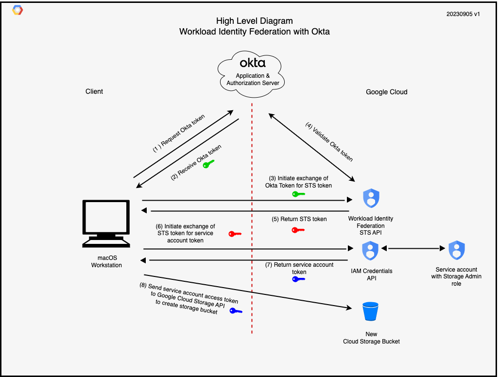
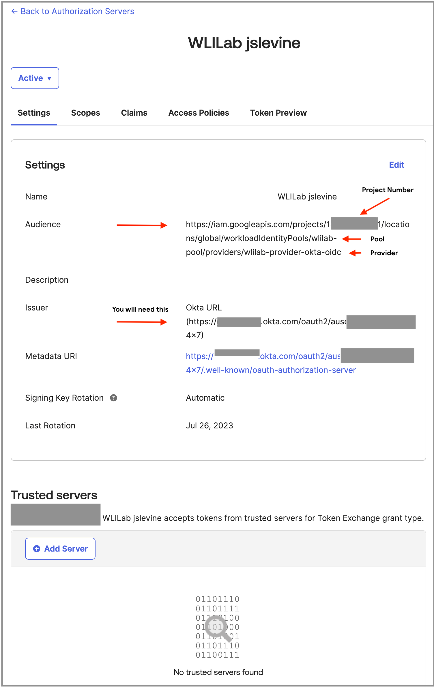
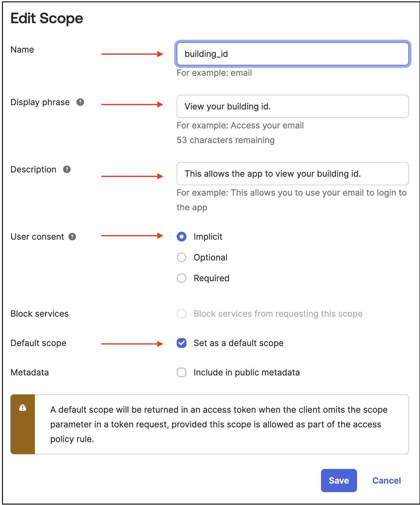
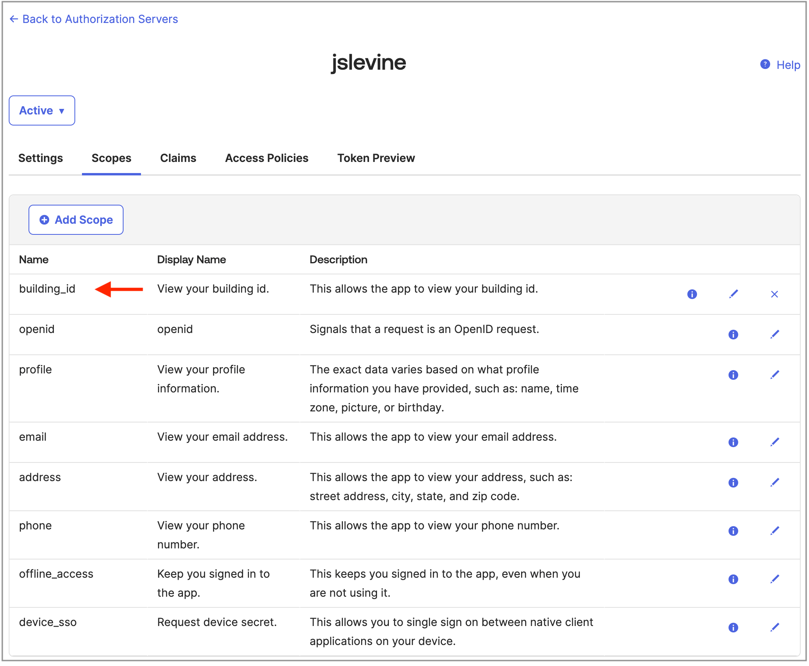
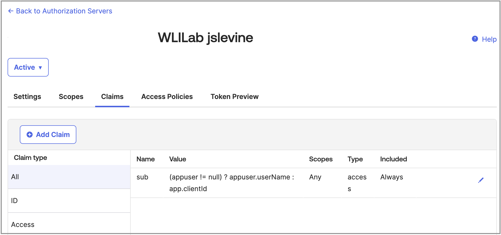
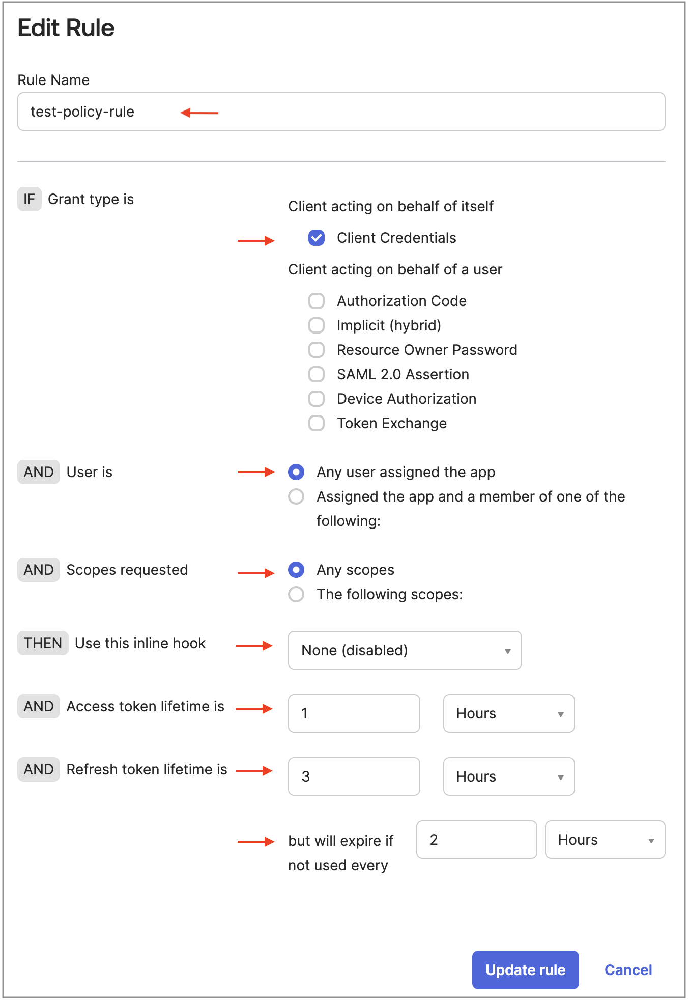

# Google Cloud Workload Identity Federation with Okta

## Introduction
Businesses with on-premise applications (or those running on another cloud) that want to call Google Cloud APIs have traditionally used Google Cloud service account keys. Service account keys are credentials which by default do not expire. Such keys, if not managed correctly, can pose a security risk.
[Workload identity federation](https://cloud.google.com/iam/docs/workload-identity-federation) ("WIF") provides a better approach for providing access to non-Google Cloud applications.

WIF has the concept of [pools](https://cloud.google.com/iam/docs/workload-identity-federation#pools) which represent collections of identities.
You associate [pool providers](https://cloud.google.com/iam/docs/workload-identity-federation#providers) which represent identity providers to pools.
This article introduces using WIF with Okta as the trusted identity provider.
A client application obtains a token from a trusted identity provider and then uses WIF to exchange that token for short term Google Cloud OAuth 2.0 tokens which can then be used to call Google Cloud APIs rather than using a service account key.

## Acknowledgements
I want to thank my colleagues for helping me to understand this topic in more depth.
One of my colleagues wrote an [article](https://medium.com/google-cloud/google-cloud-workload-identity-federation-with-okta-90c05b985b17) about this topic.
Another colleague created a [GitHub repository](https://github.com/jasonbisson/terraform-google-workload-identity-federation/tree/main) to help demo it.
A third colleague helped we with debugging efforts.
So why am I writing this article given all the work my colleagues have already done?
Mostly, because I found myself needing more guidance and I wanted to dig a little deeper into the Okta configuration and better understand the APIs as well as the RFCs that apply.
I have found that reading RFCs is extremely helpful in understanding what is happening at each step of the process.

## The scenario
Take a look at the diagram below.
The diagram shows a macOS client workstation.
The client wants to create a bucket in Google Cloud storage.
Traditionally, the client would need access to a Google Cloud service account key that that has permissions to create a bucket.
If this service account key were to somehow become public, anyone having the key would be able to create a bucket.
Rather than taking this approach, the client will reach out to Okta, an identity provider, to obtain a token and exchange it for short term Google Cloud credentials and use those credentials to create the bucket.



## Here's how it works
1. The client workstation application requests a token from their Okta service.
1. The Okta service issues a token.
    This step and the previous step implement a Client Credentials Grant as mentioned in [RFC 6749](https://datatracker.ietf.org/doc/html/rfc6749#section-4.4), the OAuth 2.0 authorization framework.
1. The workstation then initiates an exchange of the Okta token with Google Cloud using the Secure Token Service (STS) API.
1. Workload identity federation validates the Okta token.
1. Workload identity federation returns an access token from the STS API.
    This step and the two previous steps implement a token exhange per [RFC 8693](https://datatracker.ietf.org/doc/html/rfc8693), the OAuth 2.0 Token Exchange specification.
    The returned STS token is a [federated token](https://cloud.google.com/docs/authentication/token-types#federated) that cannot be used directly.
1. The workstation then initiates an exchange of the STS token for a service account token using the IAM credentials API. 
1. The IAM credentials API returns a service account access token.
     At this point, the client now has a token that allows the client to impersonate the service account.
1. The workstation then uses the service account access token to call the Google Cloud Storage API to create the bucket.
    Since the client only has short-term credentials which by default last only one hour, the risk from a compromised key is greatly reduced.

I'll go a little deeper as we go through the lab in which you will implement this Okta/WIF flow.

## Assumptions
Here are the things you will need in order to do this lab.
1. You will need access to Okta and the ability to create an application and an authorization server.
1. You should be familiar with the Okta administrative interface.
1. You will need a Google Cloud organization with a new project and administrative privileges for this lab.
1. You should be familiar with using the Google Cloud console and the `gcloud` command.
1. You should have access to the Cloud Shell for the cloud-side work.
1. You will need a place to perform the client-side tasks.
    I am using a Macbook with version Ventura 13.5.1 of macOS.
    These instructions assume that you are using a Unix/Linux like shell on your client.
    I strongly suggest *not* running the client-side steps in the Cloud Shell that you are using for the cloud-side work in order to keep the client-side and cloud-side work separate.
    Also, your client will need the the [jq](https://linuxcommandlibrary.com/man/jq) package.
   
## Additional notes
1. You may incur some charges for this lab.
    IAM API calls are free.
    Cloud Storage costs are minimal since you will only be creating a bucket.
1. I will not necessarily go through every step but I will provide some pictures to help you along the way.
1. This lab serves as an example and should not be used for production as is.
    The configuration is designed to simplify configuration and may not represent best practices.
1. As you are doing the lab, examine the shell scripts before you run them to learn more about how the various services work.
    
## Let's build this

We are now going to go through how to build this lab.
We will cover the Okta, cloud-side, and client-side portions.

### Define some variables

You will need to create a list of variables that you will use in the future.
I suggest storing a file somewhere that contains them in "export" format so you can "source" them later.

NOTE: You are *not* running this file, just gathering the information into a file.

```
# These are environment variable definitions that will be "sourced" later.
export PROJECT_ID="your Google Cloud project ID"
export PROJECT_NUMBER="your Google Cloud project number"
export WORKLOAD_POOL="wlilab-pool" # or use whatever pool name you wish
export WORKLOAD_PROVIDER="wlilab-provider-okta-oidc" # or use whatever provider name you wish
```

To find the project number, go to the Google Cloud console and select the *IAM -> Manage resources* menu option.
And the end of the line for your project, select the three vertical dots (".") and select *Settings*.

### Create the Okta application integration
You are now going to build the Okta application integration.
The application integration defines how your application will talk to Okta.
The application you will run will need to connect to Okta to generate a token using the authorization server that you will create later.

1. Log into the Okta console and then switch to the administrator window.
1. Select Applications, Create App Integration.
1. As shown in the figure below, for Sign-in method, select *API Services*.

    
    
1. Click Next.
1. Pick a name for your integration and click *Save*.

    

1. Now that you have saved the initial configuration of the application, I'll show you pictures of each part of the application's settings so you can modify your application appropriately.

1. On the *General* tab, note the settings below.
   
    

1. Use the "Copy to Clipboard" buttons and add *Client ID* and *Client Secret* to your the list of variables in the file you created.
   
    ```
    export CLIENT_ID="your Client ID"
    export CLIENT_SECRET="your Client Secret"
    ```

    You have now completed the definition of the Okta application.

### Create the Okta authorization server
You will now create the Okta authorization server.
The authorization server issues and verifies tokens.

1. If necessary, log into the Okta console and then switch to the administrator window.
1. Select Security, API, Add Authorization Server.
1. Pick a name for your authorization server.
1. For the audience, enter the value below, substituting your Google Cloud project number for PROJECT_NUMBER, your workload identity pool for WORKLOAD_POOL, and your workload identity provider for WORKLOAD_PROVIDER.  Using this format for the audience is a Google Cloud [best practice](https://cloud.google.com/iam/docs/best-practices-for-using-workload-identity-federation#provider-audience).

   ```
   https://iam.googleapis.com/projects/PROJECT_NUMBER/locations/global/workloadIdentityPools/WORKLOAD_POOL/providers/WORKLOAD_PROVIDER
   ```

1. Enter a description for your authorization server and click *Save*.

1. Now that you have saved the authorization server, you will see the *Settings* panel that shows the main settings of the authorization server.
    Click *Edit* to edit the settings.
    In the *Issuer* field, from the list of choices, pick the choice that beins with *Okta URL* and click *Save*.
    The *Settings* panel should look similar to the picture below.

    

1. Add the *Issuer* for the authentication server to the list of variables in the file you created.

   ```
   export ISSUER_URI="the issuer URI from the authentication server"
   ```

   NOTE: Do not use the issuer from the *application integration*.
   You must use the issuer from the *authentication server*.

1. The authentication server endpoint consists of the isser followed by `/v1/token` as shown [here](https://developer.okta.com/docs/reference/api/oidc/#token).
    Let's add this to the list of variables in the file you created.

    ```
    export OKTA_AZ_SERVER="$ISSUER_URI""/v1/token"
    ```

1. Click on the *Scopes* header and then select *Add Scope*.
    You will add a default scope that will always be returned.
    I made up the scope *building_id* but you can use what you wish.
    The reason for having a default scope is to ensure that the API calls return something even if no scope is specified.
    Use the picture below as a guide and then click *Save*.

    
   
1. You will now see the *building_id* scope.

    

1. On the *Claims* tab, note the conditional logic used for the *sub* claim.
    We do not have an *appuser* defined so the *sub* claim (which is the subject) will be the *Client ID*.
    There are no changes to make on the *Claims* tab.

    

1. Since the subject will be the same as the client ID, add this to your file of variables.

    ```
    export SUBJECT="$CLIENT_ID"
    ```

1. On the *Access Policy* tab, click *Add New Access Policy* or *Add Policy* and create the policy as shown below.
    The goal is to assign this rule to all users.

    

1. Click *Add New Rule* and create the rule as shown below.
    The goal is to assign this rule to all users.
    Then click *Save*.

    

1. The access policy should look like that shown below.

    

    You have now completed the definition of the authorization server.

### Define Additional variables

1. We need a few more variables for the service account and bucket locationthat will be used in Google Cloud to create the Cloud Storage bucket.

    ```
    export SERVICE_ACCOUNT_BASE="wlilab-service-account" # or whatever service account name you wish
    export SERVICE_ACCOUNT_NAME="$SERVICE_ACCOUNT_BASE@$PROJECT_ID.iam.gserviceaccount.com"
    export BUCKET_LOCATION="US" # or use any location you wish
    ```

    The variable file is now complete.
    Here are the final contents.
    Review this for accuracy.

    ```
    # These are environment variable definitions that will be "sourced" later.
    export PROJECT_ID="your Google Cloud project ID"
    export PROJECT_NUMBER="your Google Cloud project number"
    export WORKLOAD_POOL="wlilab-pool" # or use whatever pool name you wish
    export WORKLOAD_PROVIDER="wlilab-provider-okta-oidc" # or use whatever provider name you wish
    export CLIENT_ID="your Client ID"
    export CLIENT_SECRET="your Client Secret"
    export ISSUER_URI="the issuer URI from the authentication server"
    export OKTA_AZ_SERVER="$ISSUER_URI""/v1/token"
    export SUBJECT="$CLIENT_ID"
    export SERVICE_ACCOUNT_BASE="wlilab-service-account" # or whatever service account name you wish
    export SERVICE_ACCOUNT_NAME="$SERVICE_ACCOUNT_BASE@$PROJECT_ID.iam.gserviceaccount.com"
    export BUCKET_LOCATION="US" # or use any location you wish
    ```

### Google Cloud side

1. Clone this repository to your cloud-side environment (perhaps Cloud Shell).
1. Change your working directory to the top level of the cloned repository.
    The directory should contain a file named `00-setup-environment`.
1. Set the variable ROOTDIR to be the current directory.

    ```
    ROOTDIR=`pwd`
    ```

1. Edit the file `00-setup-environment' and replace all the lines with the file you created with the export definitions at the end of the *Define Variables* section and save the file.
1. Process the file by "sourcing" it.

    ```
    . ./00-setup-environment
    ```

    If any errors appear, check the syntax of the lines and make the necessary adjustments.
    If your shell exits before the completion of this section, you will need to run this step again to define the environment variables.

1. Set your current project ID in the Google Cloud SDK.

    ```
    gcloud config set project $PROJECT_ID
    ```
   
1. Change your working directory into the `cloud-side` subdirectory.

    ```
    cd $ROOTDIR/cloud-side
    ```

1. Enable the IAM credentials API so we can generate short-term credentials.

    ```
    ./05-enable-apis
    ```
    
1. Create the workload identity pool.
   
    ```
    ./10-create-wli-pool
    ```

1. Create the workload identity pool provider.

    ```
    ./20-create-wli-provider
    ```

1. Create the service account.

    ```
    ./30-create-service-account
    ```

    You should see output similar to that shown below.

    ```
    Creating service account wlilab-service-account@PROJECT_ID.iam.gserviceaccount.com...
    Created service account [wlilab-service-account].
    Creation of service account completed.
    ```

1. Add the service account resource IAM bindings.

    ```
    ./40-add-service-account-binding
    ```

    You should see output similar to that shown below.

    ```
    Adding service-account level bindings...

    Adding iam.workloadIdentityUser for the following principal:
    Principal workload pool: wlilab-pool 
    Principal workload provider: wlilab-provider-okta-oidc
    Service account: wlilab-service-account
    Project number: PROJECT_NUMBER

Addition of service-account level bindings completed.

1. Add the project-level IAM bindings.

    ```
    ./50-add-project-bindings
    ```

    You should see output similar to that shown below

    ```
    Adding bindings for wlilab-service-account in project PROJECT_ID...
    Adding the storage.admin role...
    Adding the serviceusage.serviceUsageConsumer role...
    Addition of project-level bindings completed.
    ```
    
    You have completed the cloud-side setup.
    

### Client side

> [!NOTE]
> You should do this client side portion in one sitting because the tokens that are generated expire in one hour.

1. Clone this repository to your client-side environment.
    The next few steps are identical to what you did for the cloud-side setup.
1. Change your working directory to the top level of the cloned repository.
    The directory should contain a file named `00-setup-environment`.
1. Set the variable ROOTDIR to be the current directory.

    ```
    ROOTDIR=`pwd`
    ```

1. Edit the file `00-setup-environment' and replace all the lines with the file you created with the export definitions in Part 4 and save the file.  
1. Process the file by "sourcing" it.

    ```
    . ./00-setup-environment
    ```

   If any errors appear, check the syntax of the lines and make the necessary adjustments.
   If your shell exits before the completion of this section, you will need to run this step again to define the environment variables.

   

1. Change your working directory into the `client-side` subdirectory.

    ```
    cd $ROOTDIR/client-side
    ```

1. Get a token from the Okta authorization server.

    ```
    ./60-get-okta-token
    ```
    
1. Inspect the Okta token

    ```
    $ cat /tmp/okta-token.json
    {
        "token_type": "Bearer",
        "expires_in": 3600,
        "access_token": "access-token-string",
        "scope": "building_id"
    }
    $
    ``` 

    The access token string is very long, in my case 949 characters.

1. Browse to [jwt.io](https://jwt.io/) and decode the `access_token` value.
    You should see something like this:

    ```
    {
        "ver": 1,
        "jti": "AT.hDqDc*******************Iwxo",
        "iss": "https://********.okta.com/oauth2/ause********74x7",
        "aud": "https://iam.googleapis.com/projects/4**********9/locations/global/workloadIdentityPools/wlilab-pool/providers/wlilab-provider-okta-oidc",
        "iat": 1693698425,
        "exp": 1693702025,
        "cid": "0oae********h4x7",
        "scp": [
          "building_id"
        ],
        "sub": "0oae********h4x7"
    }
    ```

    The values for several of the keys match the values from the Okta application and authorization server as shown in the table below.

    | Key | Value |
    | --- | ----- |
    | iss | The issuer from the Okta authorization server |
    | aud | The audience from the Okta authorization server |
    | sub | The Client ID from the Okta application |
    | scp | The scopes returned from the Okta authorization server, building_id since this is a default scope |
    | iat | The issue time of the token as a Unix epoch value |
    | exp | The expiration time of the token as a Unix epoch value |

    If you subtract the `iat` value from the `exp` value, you will get 3600 which is the same as the `expires_in` value from the token.

1. Exchange the Okta token for a Google Cloud STS token.


    ```
    ./70-get-sts-token
    ```

1. Inspect the STS token

    ```
    $ cat /tmp/sts-token.json
    {
        "access_token": "access-token-string",
        "token_type": "Bearer",
        "expires_in": 3502
    }
    $
    ``` 

    The access token string is very long here as well, in my case 944 characters.

1. Now exchange the STS token for an access token for the service account you created in Google Cloud.

    ```
    ./80-get-service-account-token
    ```

1. Inspect the service account access token.

    ```
    cat /tmp/service-account-token.json
    ```

    You should see output similar to the following.
   
    ```
    {
        "accessToken": "access-token-string",
        "expireTime": "2023-**-**T03:09:09Z"
    }
    $
    ```

1. Copy the accessToken value and open a browser tab to this page about [access token contents](https://cloud.google.com/docs/authentication/token-types#access-contents).
    Paste the contents of the access token into the `curl` command as shown and then copy the command and execute it in your client shell.
    The resulting token information will be similar to this example below.

    ```
    {
        "azp": "1006*************5112",
        "aud": "1006*************5112",
        "scope": "https://www.googleapis.com/auth/cloud-platform",
        "exp": "1693883349",
        "expires_in": "905",
        "access_type": "online"
    }

    In the Google Cloud console, display the service account for this lab and look at the OAuth2 Client Id value.
    The Client ID for the service account will match the `azp` and `aud` values.
    You now know that this latest acccess token is for the service account that will be used to create the Google Cloud Storage bucket.

1. Create and delete a bucket.

    ```
    ./90-create-bucket
    ```

    You should see something similar to what appears below

    ```
    creating bucket wlilab-dzvahpfg...
    The bucket was successfully created.
    Check /tmp/create-bucket-results for information about the bucket.

    Now deleting bucket wlilab-dzvahpfg...
    The bucket was successfully deleted.
    ```

    You can see more information about how the bucket was created or view error messages in the file /tmp/create-bucket-results.
    You can also verify the creation of the bucket by checking the cloud logs.
    If there was a problem deleting the bucket, look at the file /tmp/delete/bucket-results for more information.

1. You have now learned how to do the following:

   1. Get a token from the Okta authorization server
   1. Exchange the Okta token for an STS token.
   1. Exchange the STS token for a service account token.
   1. Create a bucket using the service account token.

## Clean up

> [!NOTE]
> You should clean up the Okta, client-side, and cloud-side environments if you are not going to use them any longer.
> If information such as the client id, client secret, and authorization server were to be compromised, someone could use the information to upload items to your Google Cloud storage.

### Okta

1. Log into the Okta console and then switch to the administrator window.
1. Select Applications.
1. Find the application you created.
    Deactivate it, then delete it.
1. Select Security, API.
1. Find the authorization server you created.
    Deactivate it, then delete it.

### Client-side

1. Clean up the temporary files.
    Run the script below on the client.

    ```
    ./95-cleanup-client
    ```

    You should see output similar to that shown below.

    ```
    Beginning deletion of temporary project files...
    deleting /tmp/okta-token.json...
    deleting /tmp/sts-token.json...
    deleting /tmp/service-account-token.json...
    deleting /tmp/bucket-config.json...
    deleting /tmp/create-bucket-results...
    deleting /tmp/delete-bucket-results...
    All temporary project files have been deleted.
    ```

1. Delete the cloned repository, including the environment file.
 
### Cloud-side

1. Source the environment file.

   ```
   . ./00-setup-environment
   ```

1. Remove the project-level IAM bindings.

    ```
    ./51-remove-project-bindings
    ```

    You should see output similar to that shown below

    ```
    Removing bindings for $SERVICE_ACCOUNT_BASE in project PROJECT_ID...
    Removing the storage.admin role...
    Removing the serviceusage.serviceUsageConsumer role...
    Removal of project-level bindings completed.
    Binding removal completed.
    ```

1. Remove the service account IAM bindings

   ```
   ./52-remove-service-account-binding
   ```
   
    You should see output similar to that shown below

    ```
    Removing service-account level bindings...

    Removing iam.workloadIdentityUser for the following principal:
    Principal workload pool: wlilab-pool 
    Principal workload provider: wlilab-provider-okta-oidc
    Service account: wlilab-service-account
    Project number: PROJECT_NUMBER
    ```

1. Delete the service account

    ```
    ./53-delete-service-account
    ```

    You should see output similar to that shown below.

    ```
    Deleting service account wlilab-service-account@PROJECT_ID.iam.gserviceaccount.com...
    deleted service account [wlilab-service-account@PROJECT_ID.iam.gserviceaccount.com]
    Deletion of service account completed.
    ```

1. Delete the workload identity provider

    ```
    ./54-delete-wli-provider
    ```

    The output will be similar to that shown below.

    ```
    Deleting wlilab-provider-okta-oidc in project PROJECT_ID...
    Deleted workload identity pool provider [wlilab-provider-okta-oidc].
    Deletion of wlilab-provider-okta-oidc completed.
    ```

    Note that the deleted provider remains recoverable for 30 days during which time you can undelete the provider.
    If you try to create a new provider with the same name during that timer period, you will receive an error.

1. Delete the workload identity pool

    ```
    ./55-delete-wli-pool
    ```

    You should see output similar to that shown below.

    ```
    Deleting workload identity pool wlilab-pool from project PROJECT_ID...
    Deleted workload identity pool [wlilab-pool].
    Deletion of workload identity pool completed.
    ```

    Note that the deleted pool remains recoverable for 30 days during which time you can undelete the pool.
    If you try to create a new pool with the same name during that timer period, you will receive an error.

1. Disable the IAM Crdentials API.

    ```
    ./56-disable-apis
    ```

1. Delete the cloned repository, including the environment file.
    
## Conclusion

Workload Identity Federation allows you to use your own trusted identity partner to receive short-term Google Cloud credentials so that you can call Google Cloud APIs without needing services account keys, thereby reducing the risk of resources being compromised.
In this example, you configured Okta as a trusted identity provider, configured Workload Identity Federation and a service account on Google Cloud, and then ran commands on a client to exchange tokens and eventually create a Google Cloud Storage bucket, all without service account keys and the risk that come with them.
